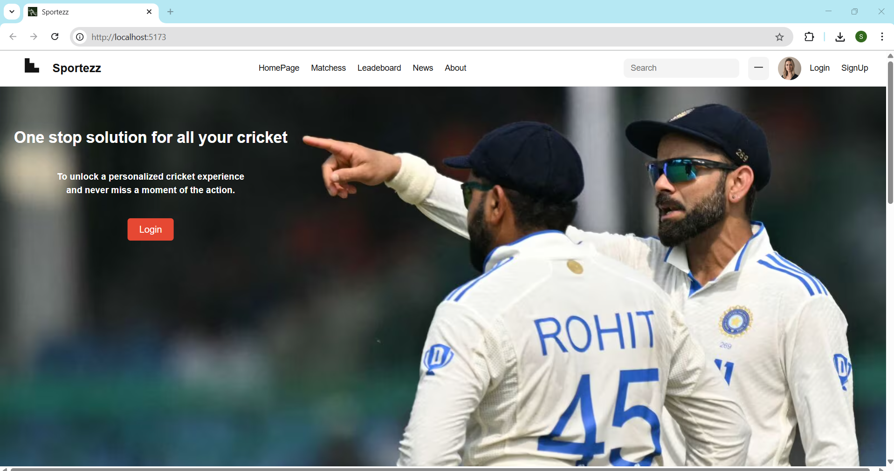
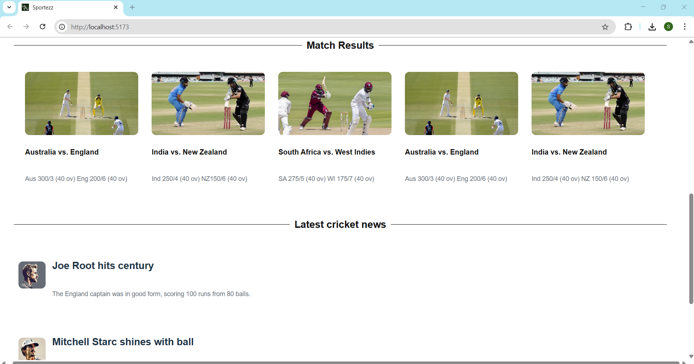
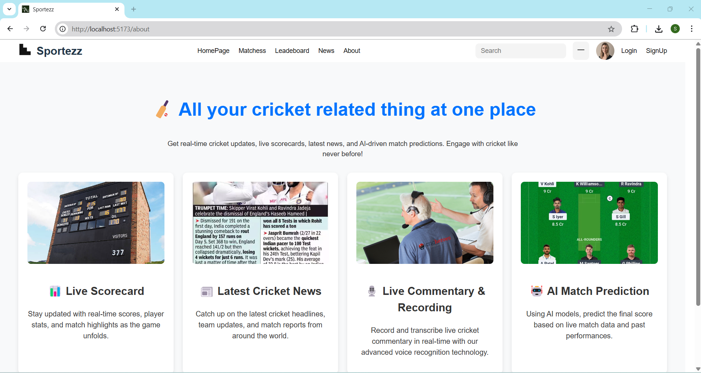
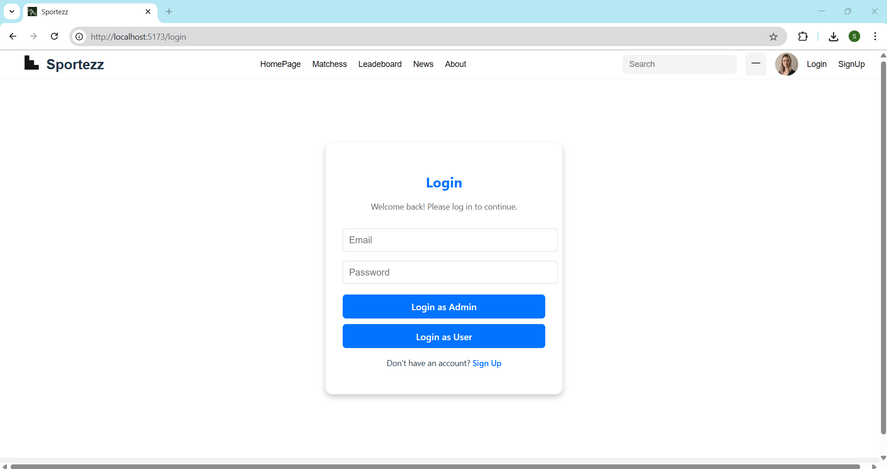
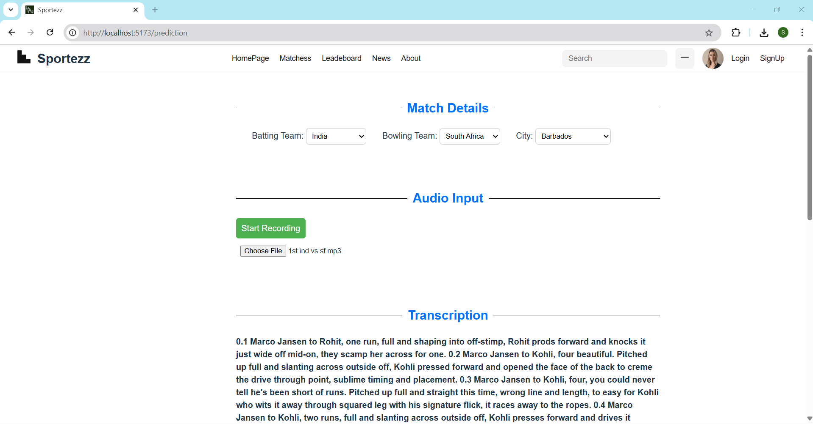
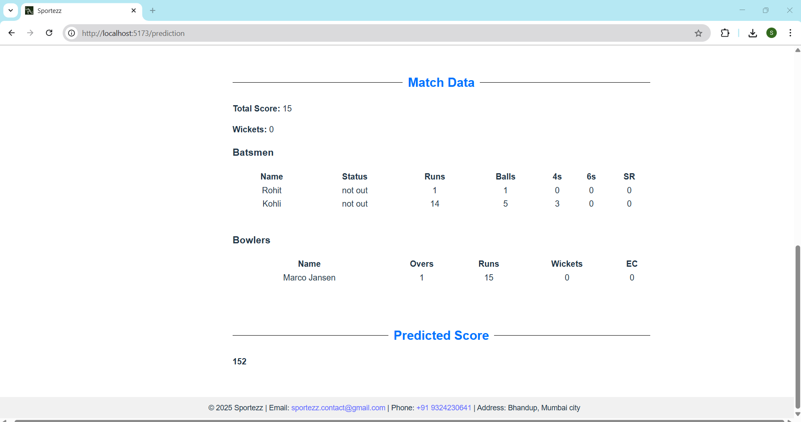
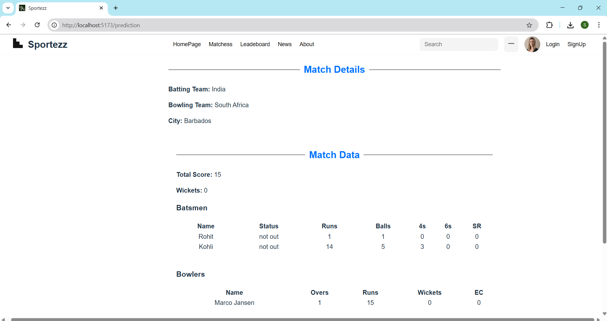
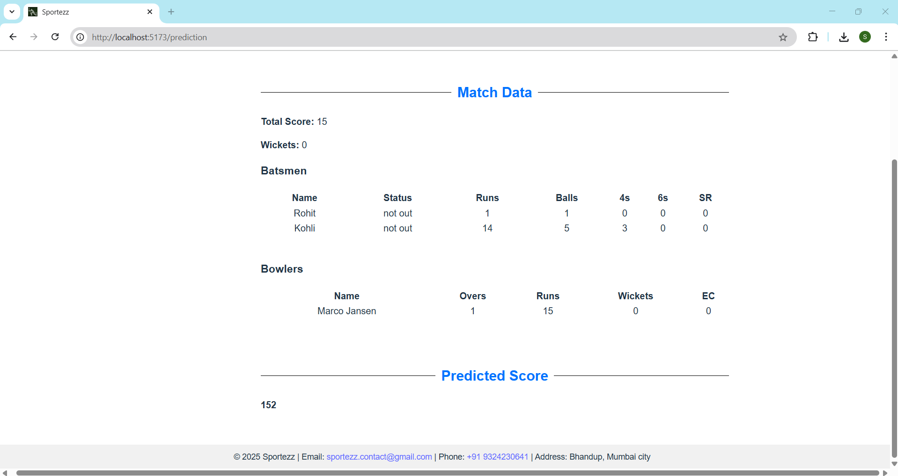

The project is about the cricket score prediction based on live commentary
It can get audio as an input throung file upload or Live recording and covert it into the text using whisper AI 
Then NLP is used to extract ball by ball data from text file it can serve as an input for prediction of score
The admin can give Teams, location and audio file to system and can generate a Scorecard from that also predict score 
Users can login and see scorecard and predicted score

For runnig project
Go to backend 
   pip install fastapi uvicorn python-multipart pandas scikit-learn whisper openai ffmpeg-python

and for whisper-ffmpeg
   download manually from ffmpeg.org → unzip → add bin folder to PATH.

Go to react-Fastapi-transcription
    npm install
    npm init -y
    npm install react react-dom
    npm install -D vite
    npm install @vitejs/plugin-react

To start a project
 Path to backend-  uvicorn main:app --reload  
 Path to react-fastapi-transcription  npm run dev    

Home Pgae
 
 

News Page
 

About Page
 

Login Page
 

Login as Admin
 
 

Login as User
 
 